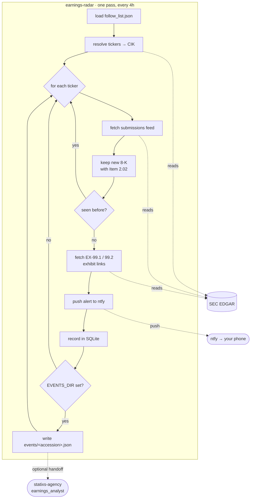

# earnings-radar

Watch a list of stock tickers and get a phone notification the moment one files
its quarterly earnings. Runs as a Docker container on a schedule in a homelab
and pushes alerts through [ntfy.sh](https://ntfy.sh). No cloud bill, no database
server — just one Python file and a SQLite state file.

```
📈 NVIDIA Corp. filed earnings
NVIDIA Corp. filed an 8-K earnings release on 2026-05-20.
[ Report ]  [ Presentation ]  [ SEC filing ]
```

## How it works

Each run: for every ticker in `follow_list.json`, read that company's filing
feed from SEC EDGAR and look for a *new* 8-K reporting **Item 2.02** ("Results
of Operations and Financial Condition") — the item a company files when it
releases quarterly results. If found, push an alert with tap-through links to
the press release (EX-99.1) and, when present, the presentation / CFO commentary
(EX-99.2/99.3). Seen filings are recorded in SQLite so nothing alerts twice.

The only data source is SEC EDGAR (free, no API key). All ~100 lines live in
[`earnings_radar.py`](earnings_radar.py).



**Limitation:** EDGAR covers US filers only, so non-US tickers (ASML, Adyen)
aren't supported.

## Setup

You need two things, both free:

1. **An ntfy topic** — just invent a long random name; it's the only thing
   protecting your alerts, so treat it as a secret. Subscribe to it in the
   [ntfy app](https://ntfy.sh/app). → `NTFY_TOPIC`
   ```bash
   echo "earnings-radar-$(openssl rand -hex 12)"
   ```
2. **A SEC User-Agent** — EDGAR blocks requests without a contact address.
   Use something like `earnings-radar you@example.com`. → `SEC_USER_AGENT`

Then edit `follow_list.json` with the tickers you care about (entries can be
`"MSFT"` or `{"symbol": "AAPL", "name": "Apple Inc."}`).

## Run it

Locally:

```bash
pip install -r requirements.txt
cp .env.example .env          # fill in NTFY_TOPIC and SEC_USER_AGENT
set -a; source .env; set +a
STATE_DB_PATH=./earnings-radar.db python earnings_radar.py
```

Run it twice — the second run should find no *new* filings, confirming dedup works.

## Docker Compose (recommended for a homelab)

The script runs one pass and exits; `docker-compose.yml` wraps it in a loop so
the container runs immediately and then **every 4 hours**, with no host cron.
State lives on a named volume, so dedup survives restarts and reboots.

```bash
git clone <your-repo-url> earnings-radar && cd earnings-radar
cp .env.example .env          # then edit: set NTFY_TOPIC and SEC_USER_AGENT
docker compose up -d --build  # builds the image and starts the scheduler
```

`.env` is gitignored, so it is **not** in the clone — you must create it on the
host (the step above). Then:

```bash
docker compose logs -f        # watch it run
docker compose down           # stop it
```

To change the cadence, edit the `sleep 14400` (seconds) in the `entrypoint` of
`docker-compose.yml` — e.g. `3600` for hourly — and `docker compose up -d`.

### One-off run (no schedule)

```bash
docker compose run --rm --entrypoint python earnings-radar earnings_radar.py
```

## Config

All via environment variables:

| Variable | Required | Default | |
|---|:---:|---|---|
| `NTFY_TOPIC` | ✅ | | private ntfy topic (secret) |
| `SEC_USER_AGENT` | ✅ | | contact UA for EDGAR |
| `NTFY_SERVER` | | `https://ntfy.sh` | ntfy instance |
| `FOLLOW_LIST_PATH` | | `follow_list.json` | watch list |
| `STATE_DB_PATH` | | `earnings-radar.db` | SQLite file (mount a volume in Docker) |
| `LOOKBACK_DAYS` | | `3` | days scanned per run |
| `LOG_LEVEL` | | `INFO` | |

## Planned next

An analysis step that, after a filing is detected, extracts the key numbers
(revenue, EPS, guidance) with a local LLM, compares them to the trailing few
quarters stored in SQLite, and uses a frontier model to write a short digest of
what actually changed. The push would then link to the digest. Not built yet —
notes in [AGENTS.md](AGENTS.md).

## Dev

```bash
pip install requests pytest
pytest
```
